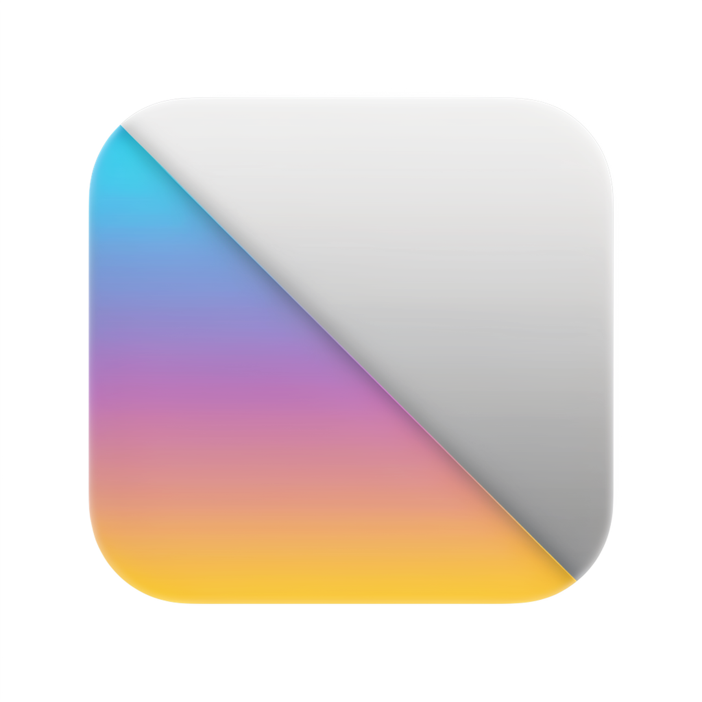

<p align="center">
  
</p>

# Grayscaler

A Windows system tray app (.NET 8 / Windows Forms) that applies a real-time grayscale effect over **a single window of your choice** — not the whole screen.

You pick a target window by clicking on it, and the app draws a gray overlay on top that follows its position, size, and state.

## How it works

It hosts a native `Magnifier` control (Windows Magnification API) configured with a grayscale color matrix. The overlay recaptures the target window's region on every tick and repaints it in gray, staying just above the target in the z-order without being global topmost.

## Download

Grab the latest `Grayscaler-vX.Y.Z-win-x64.zip` from the
[Releases](https://github.com/perereus/Grayscaler/releases) page, unzip, and run
`Grayscaler.exe`. It's a self-contained build — no .NET installation required.

## Usage

The app lives in the system tray (no main window). Right-click the tray icon:

- **Select window...** — then click the window you want to turn grayscale
- **Enable / Disable grayscale** — toggle the effect
- **Exit**

## Build from source

```powershell
cd Grayscaler
dotnet run
```

Requirements: Windows and the .NET 8 SDK.

It is Windows-specific: it relies on P/Invoke to `user32.dll` and the Magnification API (`Magnification.dll`).
